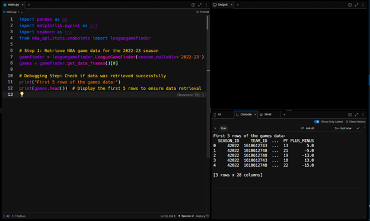
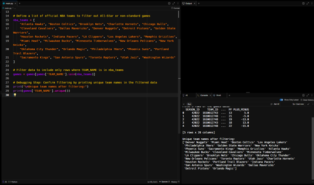
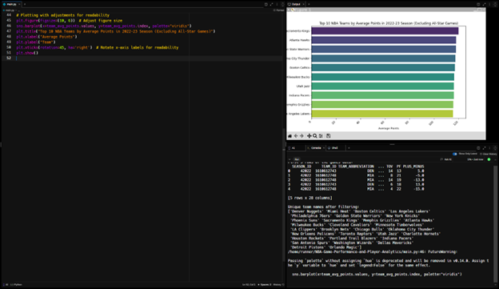

# NBA Game Performance and Player Analytics

This project analyzes NBA team performance for the 2022-23 season using data from the NBA API. I identify the top 10 NBA teams by average points scored per game.

## Project Overview

This project uses Python to retrieve, filter, analyze, and visualize NBA game data. The final output is a bar chart that displays the top 10 NBA teams based on average points scored during the 2022-23 season.

## Steps

1. **Data Retrieval**: I use the `nba_api` to fetch game data for the 2022-23 season.
   - **Screenshot**: Initial data retrieval
   -  

2. **Data Filtering**: The dataset is filtered to include only official NBA games, excluding All-Star or non-standard games.
   - **Screenshot**: Confirming filtered team names
   -  

3. **Data Analysis**: We calculate the average points per game for each team.
4. **Data Visualization**: A bar plot of the top 10 NBA teams by average points is generated.
   - **Screenshot**: Final plot of top 10 NBA teams by average points
   -  

## Requirements

To run this project, install the following Python libraries: pip install pandas requests matplotlib seaborn nba_api

## Code
- The main code for this project is in nba_analysis.py. 
- It retrieves, cleans, filters, and visualizes NBA data from the 2022-23 season.

# How to Run
Clone this repository: git clone https://github.com/yourusername/NBA-Game-Performance-Analytics.git

Install the required libraries: pip install pandas requests matplotlib seaborn nba_api

Run the code: python nba_analysis.py
